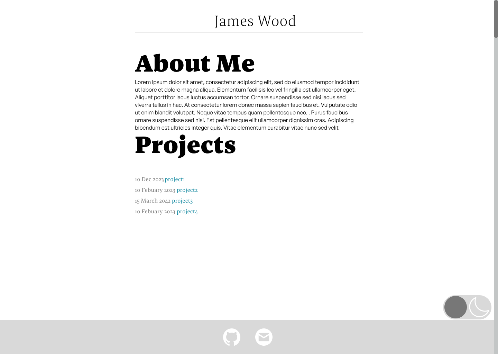

# Project: Website
This page outlines some of the steps I took in creating my portfolio website. In my university assignments, I previously used React and served React applications with Express. For this portfolio website, I wanted to try [Gatsby](https://www.gatsbyjs.com/), which is mainly used as a static site generator (SSG). Gatsby combines React and GraphQL. When using Gatsby for SSG, static pages are compiled at build time. This means that any data, React templates, and components necessary for each page are generated and compiled into a static HTML file before deployment. This avoids being rendered on-the-fly by the server in response to a user's request

To start the project, I began with a Gatsby starter site, which is a boilerplate which contains the required configuration to use Gatsby. The starter site I used was [gastsby-starter-hello-world](https://www.gatsbyjs.com/starters/gatsbyjs/gatsby-starter-hello-world) which is a bare-bones starter with minimal configuration. The page serves as a discussion of a number of steps I took to create the website from the boilerplate.


## Design
### Body text
A common guideline for readability I found was to have between 30 and 40 characters per line on mobile and 45 to 80 characters per line on larger displays. The number of characters per line is limited by the width of the `css•content-column` element which each body element is a child of. The `css•max-width` of the column is calculated using `css•65ch`. Which gives the width required to fit 65 zero characters, which gives approximately 65 characters per line. The `css•max-width` calculation also takes into account the padding on either side of the body content so the dark mode button can fit. 

```CSS {numberLines: 63,filePath:{path:'cv/src/styles/global.css',link:'https://github.com/james-door/cv/blob/main/src/styles/global.css'}}
.content-column {
    font-family: "General Sans", sans-serif;
    font-size: 1rem;
    max-width: calc(65ch + 2 * 200px * var(--dark-button-scale));
    width:100%;
    padding-inline: calc(200px*var(--dark-button-scale) + 0.8rem);
    box-sizing: border-box; 
    overflow-wrap: break-word;
    flex-shrink: 1; 
    position: relative;
}
```
When the width of the display is below `css•650px` then I change the `css•max-width` to be calculated using `css•35ch`, which is more readable for smaller displays. Moreover, the padding is adjusted as the dark mode button is flipped from being horizontal to vertical so the body content can have more room.


```CSS {numberLines: 81,filePath:{path:'cv/src/styles/global.css',link:'https://github.com/james-door/cv/blob/main/src/styles/global.css'}}
@media (max-width: 650px) {
    .content-column{
        max-width: calc(35ch + 2 *(100px * var(--dark-button-scale)));
        padding-inline: calc(100px*var(--dark-button-scale) + 0.8rem); 
    }
}
```
### Navigation bar and button
The navigation bar on the left of the project pages takes up too much space for small displays. The navigation column has the property `css•position: fixed` so that it will stay fixed as the user navigates the page. Due to this, if the vertical margins are small enough, it will overlap with the rest of the body. To address  overlap, I added the below media query which will not display the navigation bar when the width is equal to or below `css•1200px`.

 Additionally, when the display is not tall enough or when the browser window is resized, parts of the header may become inaccessible, especially on longer project pages. To deal with this I added the property `css•overflow: auto` to the navigation bar's class. 

```CSS {numberLines: 114,filePath:{path:'cv/src/styles/project.module.css',link:'https://github.com/james-door/cv/blob/main/src/styles/project.module.css'}}
@media (max-width: 1200px) {
    .headerNav {
        display: none;
    }
}
.headerNav{
    position: fixed;
    left: 0;
    top: 0;
    padding-left: 2rem;
    padding-top: 2rem;
    max-height: 100vh;
    overflow: auto;
}
```
Unlike the navigation column I want the dark mode button to be present regardless of the type of display and window size. Equivalently to the navigation bar the dark mode button also has a relative position. To avoid the dark mode button overlapping with the rest of the body I added padding to the `css•content-column` calculated from the size of the dark mode button as discussed in the [body text](#Body%20text) section. However, for narrower viewports, the padding required for the full-sized button does not leave sufficient space for the text. At `css•max-width`: 650px, the media query below changes the dark mode button, halving its width and, as a result, quartering the padding required.

```CSS {numberLines: 252,filePath:{path:'cv/src/styles/global.css',link:'https://github.com/james-door/cv/blob/main/src/styles/global.css'}}
 @media (max-width: 650px) {
    .dark-mode-button span {
        flex-direction: column;
        width: calc(100px*var(--dark-button-scale));
        height: calc(200px*var(--dark-button-scale));
    }
    .circle-left {
        top:  calc(50px*var(--dark-button-scale) - calc(46px*var(--dark-button-scale)));
        background-color: var(--left-circle-dark-mode-background-colour);
    }
    
    .circle-right {
        bottom: calc(50px*var(--dark-button-scale) - calc(46px*var(--dark-button-scale)));
        background-color: var(--right-circle-dark-mode-background-colour);
    }
}
```
For particularly small viewports the horizontal dark mode button is still too wide. In these cases I use a media query to reduce the scale of the button using the custom property `css• --dark-button-scale`.

```CSS {numberLines: 269,filePath:{path:'cv/src/styles/global.css',link:'https://github.com/james-door/cv/blob/main/src/styles/global.css'}}
@media (max-width: 400px) {
    :root {
        --dark-button-scale: 0.3;
    }
}
```


### Headers
To create contrast between the header and paragraph text the header text colour is darker than the paragraph text colour in light mode and is lighter in dark mode. Moreover, I used a Serif font for the headers and a sans serif font for the paragraph text. I decided to use 4 different text sizes using a golden ratio. Given that the default font size for most browsers is `CSS•16px` when rounding up we get the following sizes:

<table>
    <caption>Golden Ratio</caption>
    <thead>
        <tr>
            <th>Element</th>
            <th>Size (px)</th>
            <th>Size (rem)</th>
        </tr>
    </thead>
    <tbody>
        <tr>
            <td>p</td>
            <td>16</td>
            <td>1</td>
        </tr>
        <tr>
            <td>h4</td>
            <td>26</td>
            <td>1.618</td>
        </tr>
        <tr>
            <td>h3</td>
            <td>42</td>
            <td>2.618</td>
        </tr>
        <tr>
            <td>h2</td>
            <td>68</td>
            <td>4.236</td>
        </tr>
        <tr>
            <td>h1</td>
            <td>110</td>
            <td>6.854</td>
        </tr>
    </tbody>
</table>

Using `css•rem` units if the user has set a browser font size which isn't `css•16px` the ratio will be maintained while keeping their custom font size.  
The golden ratio is quite large when viewed on smaller displays such as mobile. The approach I took to solve this was to change to using a perfect fourth ratio when the width of the display is below `CSS•500px`.Evident in the below table using a perfect fourth ratio the headers are significantly smaller allowing them to fit on smaller displays

<table>
    <caption>Perfect Fourth</caption>
    <thead>
        <tr>
            <th>Element</th>
            <th>Size (px)</th>
            <th>Size (rem)</th>
        </tr>
    </thead>
    <tbody>
        <tr>
            <td>p</td>
            <td>16</td>
            <td>1</td>
        </tr>
        <tr>
            <td>h4</td>
            <td>21</td>
            <td>1.333</td>
        </tr>
        <tr>
            <td>h3</td>
            <td>28</td>
            <td>1.777</td>
        </tr>
        <tr>
            <td>h2</td>
            <td>38</td>
            <td>2.369</td>
        </tr>
        <tr>
            <td>h1</td>
            <td>51</td>
            <td>3.157</td>
        </tr>
    </tbody>
</table>

This switch in ratio is done using the following media query, when the width of the screen is below below `css•16px`. 

```CSS {numberLines: 31, filePath: {path: 'cv/src/styles/project.module.css',link:'https://github.com/james-door/cv/blob/main/src/styles/project.module.css'}}
@media (max-width: 500px){
    .projectBody h1{
        font-size: 3.157rem;
    }
    .projectBody h2{
        font-size: 2.369rem;
    }:before
    .projectBody h3{
        font-size: 1.777rem;
    }
    .projectBody h4{
        font-size: 1.333rem;
    }
}
```


### Style
During the creation of the project pages and home page I planned out the layout and colour scheme for the [light mode project page](https://www.figma.com/file/TRVV95FpmyASq4CEfHJoYc/Untitled?type=design&node-id=0%3A1&mode=design&t=eSDQ7d6SrpmtU8qP-1) and [dark mode project page](https://www.figma.com/file/TRVV95FpmyASq4CEfHJoYc/Untitled?type=design&node-id=1-82&mode=design) . As well as the [light mode home page](https://www.figma.com/file/TRVV95FpmyASq4CEfHJoYc/Portfolio-Website-Deisgn?type=design&node-id=17%3A2&mode=design&t=TizUmRjolGugokDY-1). This was useful as it allowed me to plan out both the light and dark colour schemes more easily as I didn't have to modify any CSS to do so.





To have consistent global styling for the hyperlinks I specify the following global body selectors. The style doesn't use the default hyperlink decoration but instead reveals an underline which is a pseudo-element specified using the `CSS•:after` selector. I can create a more specific `CSS•:after` selector with `CSS•display: none` if I want a different hover effect for certain links, such as for images. 

```CSS {numberLines:104,filePath:{path:'cv/src/styles/global.css',link:'https://github.com/james-door/cv/blob/main/src/styles/global.css'}}
body a{
    white-space: nowrap;
    text-decoration: none;
}

body a::after{
    margin: -3px 0;
    content: '';
    width: 0%;
    height: 2px;
    background: currentColor; 
    transition: width 0.5s;
    position: absolute;
    left: 50%;
    bottom: 0;
    transform: translateX(-50%); 
    border-radius: 10px;
}

body a:hover::after{
    width: 100%;
}
```

## Gatsby
### Page navigation
When I used React before, I defined routes using the `jsx•<BrowserRouter>` and `jsx•<Route>` to explicitly map routes to React components. Gatsby simplifies this for fixed routes by automatically creating routes from any React components in the `js•src/pages` directory. We can then navigate to these using the Gatsby `jsx•<Link>` component. In the below code fence is the `jsx•Banner` component which can be seen at the top of the page. Each folder within the `js•src/pages` represents a subroute. There can be at most one `js•index.js` file in the main route and each subroute. In the `jsx•Banner` component I route to the homepage given that the route `jsx•"/"` always routes to the `jsx•index.js` page of the current subroute.

```jsx {numberLines: 4,filePath:{path:'cv/src/components/Banner.js',link:'https://github.com/james-door/cv/blob/main/src/components/Banner.js'}}
export default function Banner() {
  return (
    <div className = 'banner-style'>
        <Link to="/">
        <h1 className="highlight-effect">James Wood</h1>
        </Link>
    </div>
  )
}
```
### Plugins
Plugins are a large part of Gatsby's functionality. There are a number of types of plugins. Source plugins bring in data from external sources. Transformer plugins can process the contents retrieved by the source plugins. Plugins are added within the `js•plugins` array in the `js•gatsby-config.js` file. In the below code fence I add the utility plugin [gatsby-plugin-react-svg](https://www.gatsbyjs.com/plugins/gatsby-plugin-react-svg/), which transforms SVGs stored in `js•/assets` to React components. Which was useful for creating the dark mode [button](#Button) and footer React components.

```JS {numberLines: 15,filePath: {path:'cv/gatsby-config.js',link:'https://github.com/james-door/cv/blob/main/gatsby-config.js'}}
  plugins: [
    {
    resolve: "gatsby-plugin-react-svg",
    options: {
      rule: {
        include: /assets/ 
      }
    }
  },
```

### GraphQL
As I discuss in the [Markdown](#Markdown) section I use Markdown files, stored locally, to hold the contents of the project pages. As a result I have to access these markdown files to display them to the user. Gatsby handles all data using a single GraphQL node. GraphQL is a query language that can be used to request or mutate data from a server or local source. This is an alternative to sending requests to a REST API using endpoints. 

For Markdown files to be accessible within my project, they need to be integrated into Gatsby's data layer. This integration makes them queryable via GraphQL. Gatsby does this by using plugins. To query local source files I used the plugin [gatsby-source-filesystem](https://www.gatsbyjs.com/plugins/gatsby-source-filesystem/). For each instance of the plugin specified in the `js•gatsby-config.js` the files in `js•path` are added to the GraphQl node. 

```JS {numberLines: 26,filePath:{path:'cv/gatsby-config.js',link:'https://github.com/james-door/cv/blob/main/gatsby-config.js'}}
    {
      resolve: `gatsby-source-filesystem`,
      options: {
        name: `personalProjectsMarkup`,
        path: `${__dirname}/src/personalProjectsMarkup/`,
      },
    },
```


## Markdown
### Generating Project Pages
Instead of writing HTML for every project page, I generate the HTML for the project pages from markdown. This has a number of advantages, one of which is that I find it easier to write the project pages in Markdown than in HTML. For instance this page you are reading is generated from this [Markdown](https://github.com/james-door/cv/blob/main/src/personalProjectsMarkup/website.md)

By just using the `js•gatsby-source-filesystem`, the markdown nodes added to the GraphQl layer are treated just as files. To better query the markdown, access the front matter, and importantly, transform the markdown into HTML, I used a Gatsby transformer plugin. The plugin [gatsby-transformer-remark](https://www.gatsbyjs.com/plugins/gatsby-transformer-remark/) interprets any markdown files added to the GraphQl node and transforms the body content into HTML.

Gatsby offers a NodeJS environment to execute code in during the build time in the `js•gatsby-node.js` file. In this file we can query the markdown nodes that the transformer plugin created. In each of the markdown files I store the slug for the page in the frontmatter as `js•URLslug`. For each project page I use a template `js•project-page-template.js` which I discuss in [Generating HTML](#Generating%20HTML).

```js {numberLines,filePath:{path:'cv/gatsby-node.js',link:'https://github.com/james-door/cv/blob/main/gatsby-node.js'}} 
const path = require('path');

exports.createPages = async ({graphql, actions})=>{

    const {data} = await graphql(`
    query ProjectPages {
        allMarkdownRemark {
          nodes {
            frontmatter {
              URLslug
            }
          }
        }
      }
    `)

    data.allMarkdownRemark.nodes.forEach(page=>{
        actions.createPage({
            path: page.frontmatter.URLslug,
            component: path.resolve("src/templates/project-page-template.js"),
            context: {slug:page.frontmatter.URLslug}
        })
        
    })
};
```

### Generating HTML
 For each project page I use the template`js•project-page-template.js` to generate it. In Gatsby in an ES6 environment when we export a GraphQL query from a page component Gatsby automatically executes the query during the build process injecting the query result into the pages component's props. In the below code `jsx•query` is exported which injects parsed content into the `jsx•data` prop. I then use the headers to create the [navigation column](#Navigation%20Column) component. 
 
```jsx {numberLines:63, filePath:{path:'cv/src/templates/project-page-template.js', link:'https://github.com/james-door/cv/blob/main/src/templates/project-page-template.js'}}
export default function PageFormat({data}) {
  return (
    <Layout>
      <section className={styles.projectBody}>
      <PageNavigationColumn HeadingData={data.markdownRemark.headings}/>
       {HtmlManipulator(data.markdownRemark.html)}
      </section>
    </Layout>
  )
}

export const query = graphql`
query PageContent($slug: String) {
  markdownRemark(frontmatter: {URLslug: {eq: $slug}}) {
    headings {
      value
      depth
    }
    html
  }
}
`
```
The `jsx•HtmlManipulator` uses the library [html-react-parser](https://www.npmjs.com/package/html-react-parser) to perform processing on the HTML to convert them into React elements. This is not required and I could just use the React attribute `jsx•dangerouslySetInnerHTML` to convert the HTML code, which is transformed by gatsby-transformer-remark, into a format that can be displayed. However, I use this to insert the [bar](#Bar) above the code fences and also to add an ID to each of the headers for the [navigation bar](#Navigation%20Bar). This code is currently being run in the browser. Ideally, this would be run during build time, given that the html-react-parser supports NodeJS and Gatsby offers the `js•gatsby-node.js` file, but I couldn't get it working.

```JSX {numberLines:33, filePath:{path:'cv/src/templates/project-page-template.js', link:'https://github.com/james-door/cv/blob/main/src/templates/project-page-template.js'}}
const HtmlManipulator = (htmlContent) => {
  return parse(htmlContent, {
    transform(reactNode, domNode) {
    
      if (domNode.type === 'tag' && ['h1', 'h2', 'h3'].includes(domNode.name)){
        return (
          React.createElement(
            domNode.name,
            { id: domNode.children[0].data},
            domToReact(domNode.children, {})
          )
        );
      }
      else if (domNode.attribs && domNode.attribs.class && domNode.attribs.class.includes('grvsc-container')) {
      return( 
        <>
        <div className={styles.codeFenceBar}>{FileLink(domNode.attribs.class)}</div>
          {reactNode}  
        </>
        );
      }
      else{
        return(<>{reactNode}</>)
      }
    },
  });
};
```


## Code Fence

The code fences in the project pages consist of a syntax highlighter and a bar above the code indicating the language and the file path in the project's repository. The file path has the link to the Github page embedded.

### Syntax Highlighter 
I wanted a syntax highlighter to present my code in a more readable fashion. For this, I chose
[gatsby-remark-vscode](https://www.gatsbyjs.com/plugins/gatsby-remark-vscode/) which is a plugin that extends the functionality of the gatsby-transformer-remark plugin. The plugin modifies the markdown fenced code block adding HTML and CSS to style them. Most other syntax highlighters I looked at were made to run in the browser. This meant they had to be relatively fast and lightweight as they are downloaded and executed whenever the page is loaded. Whereas gatsby-remark-vscode generates the HTML during the build time. Because of this gatsby-remark-vscode opts to use the same code used by Visual Studio Code's syntax highlighter which while larger and slower, performs more accurate syntax highlighting. 

The plugin exposes a number of CSS classes that can be used to style the code fences. The main one being `CSS•grvsc-container` which is at the top of the hierarchy. I use this class to set a monospaced font for the code in the fence. The rest of the classes in the below code fence adjust the position of the code within its fence.

```CSS {numberLines : 333,filePath:{path:'cv/src/styles/global.css',link:'https://github.com/james-door/cv/blob/main/src/styles/global.css'}}
.grvsc-container{
    margin-top: 0rem; 
    margin-bottom: 1rem; 
    font-family: 'Source Code Pro', monospace;
}

.grvsc-container code{
    width: 100%;
}

.grvsc-line-number {
    width: 0px;
    
}

.grvsc-gutter-pad{
    width: 0px;
    display: none;
}
```


### Bar
The syntax highlighter plugin I used came with no options to add an indication of what language or the file of the current code fence. Therefore, I decided to make a bar above the code fence that would display just that. Initially I implemented the bar using the `CSS•::before` selector as is seen in the below CSS.

```CSS {numberLines}
.grvsc-container[data-language]::before{
    content: attr(data-language);
    position: absolute;
    left: 0;
    right: 0;
    top: 0;
    width: 100%;
    text-align: center;
    background-color: var(--code-block-colour);
}
```
 Nevertheless, using this method I was only able to include the language and wasn't able to pass other information from the markdown such as the file. Moreover, the bar did not always match the correct width when there was overflow in the `CSS•grvsc-container`, such that when scrolling you would go past the right edge of the bar. Instead I used the HTML parser discussed in [Generating HTML](#Generating%20HTML) to insert the bars above every code fence.

One feature of gatsby-remark-vscode allows adding a custom class to `CSS•grvsc-container`. The custom class is added by specifying the name of the class as the value of the `JS•wrapperClassName` property of the plugin's option object. This class name can optionally be returned by a JS function. This function has two useful parameters, `JS•parsedOptions` which allows us to pass a custom object from the markdown and `JS•language` which is the language of the code fence. I pass the custom `JS•filePath` object from the markdown which specifies the file path and a link to the Github page. Using this information I set the custom class `CSS•grvsc-container` to contain this information, using `JS•__` as a delimiter. Also I appended the `JS•numberLines` property to the Github URL with the fragment identifier #L, which Github uses to allow jumping to a particular line of code.

```JS {numberLines: 60, filePath: {path:'cv/gatsby-config.js',link: 'https://github.com/james-door/cv/blob/main/gatsby-config.js'}}
    wrapperClassName: ({ parsedOptions, language, markdownNode, node }) => {
         const filePath = parsedOptions.filePath;
          if (filePath) {
             return `${language.toUpperCase()}__${filePath.path}__${filePath.link}#L${parsedOptions.numberLines}`;
          }
          return language.toUpperCase();
          }
```
To create the bar, I locate DOM nodes with the class `jsx•grvsc-container` in the template, and above each of these elements, I insert the language and file link. 

```jsx {numberLines: 46, filePath:{path:'cv/src/templates/project-page-template.js', link:'https://github.com/james-door/cv/blob/main/src/templates/project-page-template.js'}}
      else if (domNode.attribs && domNode.attribs.class && domNode.attribs.class.includes('grvsc-container')) {
      return( 
        <>
        <div className={styles.codeFenceBar}>{FileLink(domNode.attribs.class)}</div>
          {reactNode}  
        </>
        );
      }
      else{
        return(<>{reactNode}</>)
      }
```

## Dark Mode
### Styling
To enable switching between a dark and light mode I defined the colour properties for every element using CSS custom properties. The switch between light and dark modes is controlled by changing the `CSS•"colour-theme"` attribute. Depending on its value (either `CSS•"light"` or `CSS•"dark"`), different sets of CSS custom properties are applied through attribute selectors

```CSS {numberLines : 7,filePath:{path:'cv/src/styles/global.css',link:'https://github.com/james-door/cv/blob/main/src/styles/global.css'}}
[colour-theme="dark"] {
    --code-block-colour: #3B2E58;
    --background-colour: #242525;
    --inline-code-colour: #C4BDB3;
    --inline-code-background: #002B36;
    --paragraph-text-colour: #C4BDB3;
    --header-text-colour: #E3DBCF; 
    --scroll-bar-track-colour: #2b2d2d;
    --scroll-bar-colour: #4c4c4c;
    --scroll-bar-hover-colour: #777;
    --contact-me-icon-colour: #E3DBCF;
    --footer-background-colour: #7777;
    --header-colour: #777777;
    --dividing-bar-colour: #7777;
    --dark-mode-button-background-colour: #7777; 
    --dark-mode-button-colour: white; 
    --left-circle-dark-mode-background-colour: transparent;
    --right-circle-dark-mode-background-colour: white;
}
[colour-theme="light"] {
    --code-block-colour: #f7df1e;
    --background-colour: white;
    --inline-code-colour: #373737;
    --inline-code-background: #FDF6E3;
    --paragraph-text-colour: #373737;
    --header-text-colour: black;
    --scroll-bar-colour: #777777;
    --scroll-bar-hover-colour: #4c4c4c;
    --scroll-bar-track-colour: #C3C6C6;
    --contact-me-icon-colour: white;
    --footer-background-colour: #bbbbbb98;
    --header-colour: #373737;
    --dividing-bar-colour: #EEEEEE;
    --dark-mode-button-colour: white; 
    --dark-mode-button-background-colour: #bbbbbb98;
    --left-circle-dark-mode-background-colour: #777777;
    --right-circle-dark-mode-background-colour: transparent;
}
```
CSS custom properties cascade like other CSS properties. To ensure that every element  inherits the properties, I assigned the `html•colour-theme` attribute to the root element, `html•<html>`. The root element `html•colour-theme` attribute is set to the value of the React state variable `jsx•darkModeState` whenever the page is first loaded or if the value `jsx•darkModeState` is changed. This functionality is achieved using a `jsx•useEffect` hook, as evident in the below code fence.

To store the state of `jsx•darkModeState` between sessions I use the Web Storage API, which I found was easier to use than cookies. The value of `jsx•darkModeState` is initally set using the `jsx•useState` hook where it tries to retrieve the value for a local storage key named `html•darkModeState`. If it fails to do so, it sets the React state variable to `js•"light"`. This means that `js•"light"` is the default value of the React state variable.


```jsx {numberLines: 5,filePath:{path:'cv/src/components/DarkModeButton.js',link:'https://github.com/james-door/cv/blob/main/src/components/DarkModeButton.js'}}
const [darkModeState, setDarkMode] = useState(() => {
    if (typeof window !== 'undefined') {
      return localStorage.getItem('darkModeState') || 'light';
    }
    return 'light';
  });

  useEffect(() => {
    document.documentElement.setAttribute('colour-theme', darkModeState);
  }, [darkModeState]);
```

The syntax highighter allows me to change between different Visual Studio Code themes. Using the `js•theme` option in the gatsby-remark-vscode plugin allows me to set a number of parent selectors. When the `html•<html>` attribute is set to `css•light` then the code fences will use the `css•Solarized Light` theme. When its attriubte is set to `css•dark` the code fences will use the `css•Solarized Dark` theme.

```JS {numberLines: 53,filePath: {path:'cv/gatsby-config.js',link:'https://github.com/james-door/cv/blob/main/gatsby-config.js'}}
  theme:{
            default: 'Solarized Light',
            parentSelector: {
              'html[colour-theme=light]': 'Solarized Light',
              'html[colour-theme=dark]': 'Solarized Dark',
            },
        },
```


### Button
The dark mode button in the bottom right of the page allows the user to change the value of `css•colour-theme` attribute. Whenever the button is triggered the state of the React variable `jsx•darkModeState` is inverted.

The button is made up of a two SVGs, `jsx•<Sun>` and `jsx•<Moon>`, which the plugin gatsby-plugin-react-svg transforms into React components. The two circles either obscure the `jsx•<Sun>` or `jsx•<Moon>` depending on which theme is active.   

The style for this button is heavily inspired by the dark mode button on this [website](https://www.3dgep.com/). 

```JSX {numberLines: 16,filePath:{path:'cv/src/components/DarkModeButton.js',link:'https://github.com/james-door/cv/blob/main/src/components/DarkModeButton.js'}}}
  const changeDarkMode = () => {
    const newState = darkModeState === 'light' ? 'dark' : 'light';
    setDarkMode(newState);
    localStorage.setItem('darkModeState', newState);
  };
  return (
    <button onClick={changeDarkMode} className='dark-mode-button'>
      <span >
        <div className='circle-left'/>
        <div className='circle-right'/>
        <Sun className = 'sun-button'/>
        <Moon className = 'moon-button'/>
      </span>
    </button>
  )
```
The button has `css•position: sticky` so that it is treated like a fixed element. It will stick to the bottom of the viewport, with a bottom gap set to `css•0.5rem`. When the button reaches the end of its container, `css•content-column`, it will switch to static behavior. This avoids it overlapping with the footer.

The width and height of the `css•<span>` and the two circles are scaled by the custom property `css•--dark-button-scale`. The button fits around the `html•<span>` element and both SVGs are flex children of the `html•<span>` element, with both flex-grow and flex-shrink properties. The two circles have their size and position calculated with `css•--dark-button-scale`. When `css•colour-theme` is `css•light` the colour of the circle over the moon is transparent. When `css•colour-theme` is `css•dark` the colour of the circle over the sun is transparent.
 
```CSS {numberLines : 198,filePath:{path:'cv/src/styles/global.css',link:'https://github.com/james-door/cv/blob/main/src/styles/global.css'}}
 .dark-mode-button {
    position: sticky;
    right: 0;
    bottom: 0.5rem;
    z-index: 2;
    background-color: transparent;
    border-color: transparent;
    cursor: pointer;
    fill: var(--dark-mode-button-colour);
    margin-left: auto; 
    margin-right: 0.6rem;   
} 

 .dark-mode-button span {
    position: relative;
    display: flex;
    background-color: var(--dark-mode-button-background-colour);
    border-radius: calc(50px*var(--dark-button-scale));
    width: calc(200px*var(--dark-button-scale));
    height: calc(100px*var(--dark-button-scale));
    justify-content: center;
    align-items: center;
} 

 .moon-button, .sun-button {
    flex: 1;
    margin: 5px 5px;
    max-width: 100%;
    max-height: 100%;
    stroke: var(--dark-mode-button-colour);
}
```


## Navigation Bar
### Navigating with fragments
In order to make navigation in project pages easier, for each project's page, a list of anchors is generated. This facilitates easier access to sections marked as `CSS•<h2>` and `CSS•<h3>`. The list is displayed on the left of the page, using media queries, the list is hidden when there is insufficient room. Navigation is achieved using URL fragments.

 I use the html-react-parser to transform the `CSS•<h2>` and `CSS•<h3>` elements so that each has an ID corresponding to its header text, as seen in the below React code. Fragment identifiers must be unique; thus, each header must have a unique identifier. If I felt I needed repeated headers for different depth I could append the depth to the ID.

```JSX {numberLines: 37, filePath:{path:'cv/src/templates/project-page-template.js', link:'https://github.com/james-door/cv/blob/main/src/templates/project-page-template.js'}} 
   if (domNode.type === 'tag' && ['h1', 'h2', 'h3'].includes(domNode.name)){
        return (
          React.createElement(
            domNode.name,
            { id: domNode.children[0].data},
            domToReact(domNode.children, {})
          )
        );
      }
```

The navigation column is a React component `JSX•PageNavigationColumn`. The component is passed a single prop that is an array of JS objects containing the depth and values for each header in the page. Each header is passed to `JSX•FormatHeadingList`. The depth of the header is used to dynamically assign a class name to the list item element. Headers of depth 1 are ignored, meaning that the project title isn't included on the navigation bar. Headers of depth 2 and 3 have different styles, to visually differentiate them in the navigation bar. Moreover, using the React state variable `JSX•activeHeader` I keep track of which header is currently selected, and add the `CSS•selectedHeader` style to that header. 

```JSX {numberLines: 4, filePath: {path: 'cv/src/components/PageNavigationColumn',link: 'https://github.com/james-door/cv/blob/main/src/components/PageNavigationColumn.js'}}
 export default function PageNavigationColumn(props) {
  const [activeHeader, setActiveHeader] = useState('');
                            ...
    const FormatHeadingList = (headingList) => {//37
    let style = '';
    //Exclude h1
    if (headingList.depth === 1) {
      return <></>;
    }
    //If selected use the activeHeader style
    if (headingList.value === activeHeader) {
      style = styles.selectedHeader;
    }
    return (
      
      <li key={headingList.value.replace(/[^a-zA-Z0-9]/g, '')+"-"+"headingList.depth"} className={`${styles[`depth${headingList.depth}`]} ${style}`} >
        <a href={`#${headingList.value}`}>
          {headingList.value}
        </a>
      </li>
    );
  };

  return (
    <div className={styles.headerNav}>
    <h2>Page Contents</h2>
    <ul>
      {props.HeadingData.map(FormatHeadingList)}
    </ul>
    </div>
  );
}
}
```

### Selected Header
 I used a `JSX•useEffect` hook to add the listeners `JS•hashchange` and `JS•scroll` whenever the navigation bar component is mounted. And to remove the listeners when the component is unmounted. A header is selected if the top of the viewport goes within 0 to 50 pixels above that header, or if the viewport is above the main header for the page, or if the user uses a fragment identifier to navigate to the header. 
```JSX {numberLines: 7, filePath: {path: 'cv/src/components/PageNavigationColumn',link:'https://github.com/james-door/cv/blob/main/src/components/PageNavigationColumn.js'}}
  const currentViewportHeader =() => {
    const elements = document.querySelectorAll('h1[id], h2[id], h3[id]');
    for (let el of elements) {
      const rect = el.getBoundingClientRect();
      if (rect.top > -50 && rect.top < 0 || (el.tagName ==='H1' && rect.top > 0)) {
        return el.innerText;
      }
    }
    return activeHeader;
  }
  const handleScroll = ()=>{
    const current = currentViewportHeader();
    if(current !==''){
      setActiveHeader(current);
    }
  };

  const handleHashChange = () => {
    setActiveHeader(window.location.hash.substring(1).replace(/%20/g, ' '));
  };

  useEffect(() => {
    window.addEventListener('hashchange', handleHashChange);
    window.addEventListener('scroll', handleScroll);
    return () => {
      window.removeEventListener('hashchange', handleHashChange);
      window.removeEventListener('scroll', handleScroll);
    };
  }, []);
```


