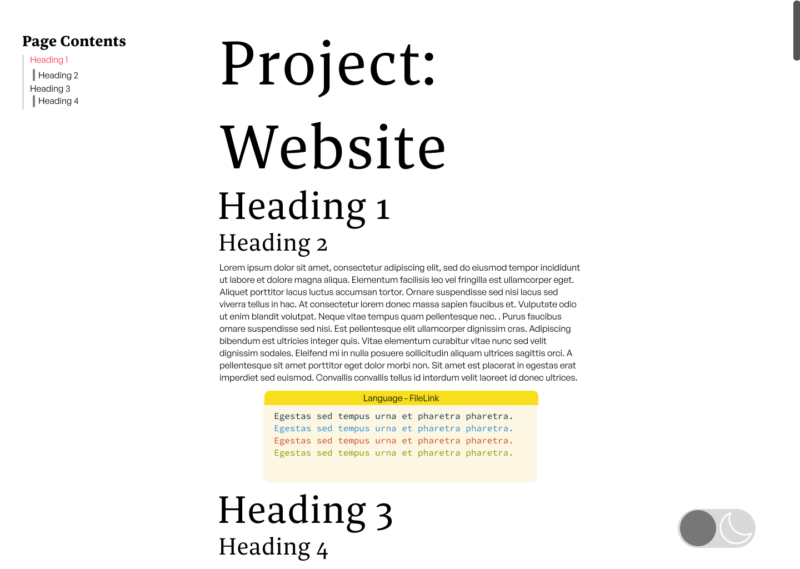
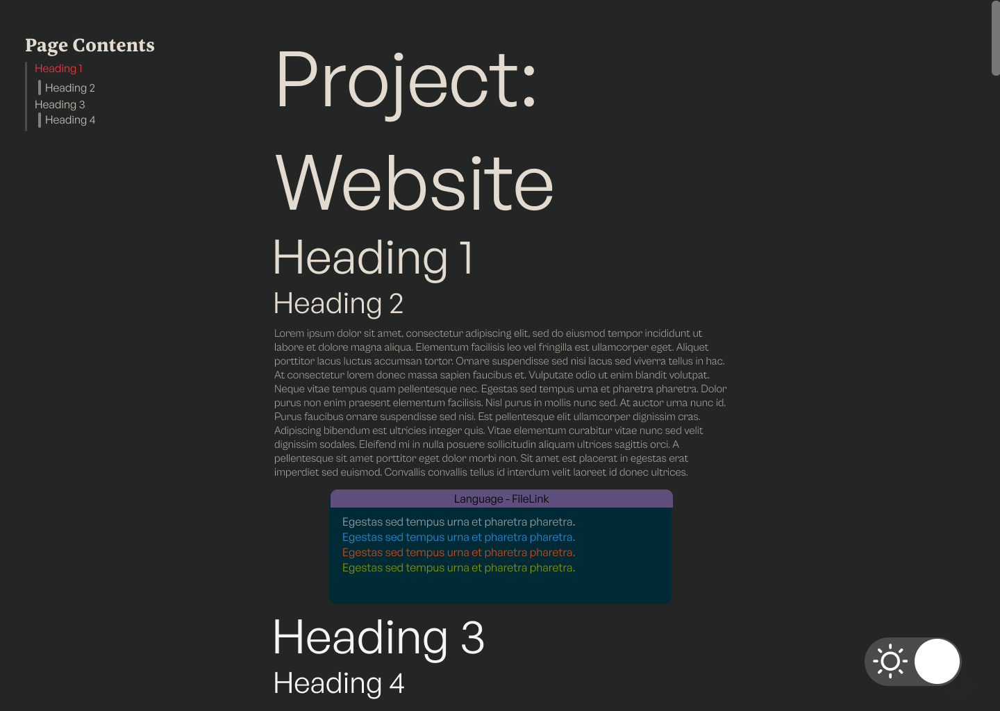

# Project: Website
## Design
### Body text
A common guideline for readability I found was to have between 30 and 40 characters per line on mobile and 45 to 80 characters per line on larger displays. The number of characters per line is limited by the width of the `css•content-column` element which each body element is a child of. The `css•max-width` of the column is calculated using `css•65ch`. Which gives the width required to fit 65 zero characters, which gives approximately 65 characters per line. The `css•max-width` calculation also takes into account the padding on either side of the body content so the dark mode button can fit. 

```CSS {numberLines: 65,filePath:{path:'cv/src/styles/global.css',link:'https://github.com/james-door/cv/blob/main/src/styles/global.css'}}
.content-column {
    font-family: "General Sans", sans-serif;
    font-size: 1rem;
    max-width: calc(65ch + 2 * 200px * var(--dark-button-scale));
    width:100%;
    padding-inline: calc(200px*var(--dark-button-scale) + 0.5rem);
    box-sizing: border-box; 
    overflow-wrap: break-word;
    flex-shrink: 1; 
}
```
When the width of the display is below `css•650px` then I change the `css•max-width` to be caclulated using `css•35ch`, which is more readable for smaller displays. Moreover, the padding is adjusted as the dark mode button is flipped from being horizontal to vertical so the body content can have more room.


```CSS {numberLines: 82,filePath:{path:'cv/src/styles/global.css',link:'https://github.com/james-door/cv/blob/main/src/styles/global.css'}}
@media (max-width: 650px) {
    .content-column{
        max-width: calc(35ch + 2 *(100px * var(--dark-button-scale) +0.5rem));
        padding-inline: calc(100px*var(--dark-button-scale) + 0.5rem); 
    }
}
```
### Navigation bar and button
The navigation bar on the left of the project pages takes up too much space for small displays. The navigation column has the property `css•position: fixed` so that it will stay fixed as the user navigates the page. Due to this if the vertical margins are small enough it will overlap with the rest of the body. To address  this, I added the below media query which will not display it when the width is equal to or below `css•1200px`. Additionally, when the display is not tall enough or when the browser window is resized, parts of the header may become inaccessible, espeically on longer project pages. To deal with this I added the property `css•overflow: auto` to the navigation bar's class. 

```CSS {numberLines: 122,filePath:{path:'cv/src/styles/project.module.css',link:'https://github.com/james-door/cv/blob/main/src/styles/project.module.css'}}
@media (max-width: 1200px) {
    .headerNav {
        display: none;
    }
}
.headerNav{
    position: fixed;
    left: 0;
    top: 0;
    padding-left: 2rem;
    padding-top: 2rem;
    max-height: 100vh;
    overflow: auto;
}
```
Unlike the navigation column I want the dark mode button to be present regardless of the type of display and window size. Equivalently to the navigation bar the dark mode button also has a relative position. To avoid the dark mode button overlapping with the rest of the body I added padding to the `css•content-column` calculated from the size of the dark mode button as discussed in [Body text](#Body%20text) section. However, for narrower viewports, the padding required for the full-sized button does not leave sufficient space for the text. At css•max-width: 650px, the media query below changes the dark mode button, halving its width and, as a result, quartering the padding required."

```CSS {numberLines: 265,filePath:{path:'cv/src/styles/global.css',link:'https://github.com/james-door/cv/blob/main/src/styles/global.css'}}
 @media (max-width: 650px) {
    .dark-mode-button span {
        flex-direction: column;
        width: calc(100px*var(--dark-button-scale));
        height: calc(200px*var(--dark-button-scale));
    }
    .circle-left {
        top:  calc(50px*var(--dark-button-scale) - calc(46px*var(--dark-button-scale)));
        background-color: var(--left-circle-dark-mode-background-colour);
    }
    
    .circle-right {
        bottom: calc(50px*var(--dark-button-scale) - calc(46px*var(--dark-button-scale)));
        background-color: var(--right-circle-dark-mode-background-colour);
    }
}
```
For particulary small viewports the horizontal dark mode button is still to wide. In these cases I use a media query to reduce the scale of the button using the custom propertry `css• --dark-button-scale`.

```CSS {numberLines: 282}
@media (max-width: 400px) {
    :root {
        --dark-button-scale: 0.3;
    }
}
```


### Headers
To create contrast between the header and paragraph text the header text colour is darker than the paragraph text colour in light mode and is lighter in dark mode. Moreover, I used a Serif font for the headers and a sans serif font for the paragraph text. I decided to use 4 different text sizes using a golden ratio. Given that the default font size for most browsers is 16 px this when rounding up we get the following sizes

<table>
    <caption>Golden Ratio</caption>
    <thead>
        <tr>
            <th>Element</th>
            <th>Size (px)</th>
            <th>Size (rem)</th>
        </tr>
    </thead>
    <tbody>
        <tr>
            <td>p</td>
            <td>16</td>
            <td>1</td>
        </tr>
        <tr>
            <td>h4</td>
            <td>26</td>
            <td>1.618</td>
        </tr>
        <tr>
            <td>h3</td>
            <td>42</td>
            <td>2.618</td>
        </tr>
        <tr>
            <td>h2</td>
            <td>68</td>
            <td>4.236</td>
        </tr>
        <tr>
            <td>h1</td>
            <td>110</td>
            <td>6.854</td>
        </tr>
    </tbody>
</table>

Using `CSS•rem` units if the user has a browser set default font size which isn't 16px it will maintain the ratio while keeping their custom font size.  
The goldren ratio is gets quite large when viewed on smaller dispalys such as mobile. The approach I took to solve this was change to using a perfect fourth ratio when the width of the display is below `CSS•500px`. 

<table>
    <caption>Perfect Fourth</caption>
    <thead>
        <tr>
            <th>Element</th>
            <th>Size (px)</th>
            <th>Size (rem)</th>
        </tr>
    </thead>
    <tbody>
        <tr>
            <td>p</td>
            <td>16</td>
            <td>1</td>
        </tr>
        <tr>
            <td>h4</td>
            <td>21</td>
            <td>1.333</td>
        </tr>
        <tr>
            <td>h3</td>
            <td>28</td>
            <td>1.777</td>
        </tr>
        <tr>
            <td>h2</td>
            <td>38</td>
            <td>2.369</td>
        </tr>
        <tr>
            <td>h1</td>
            <td>51</td>
            <td>3.157</td>
        </tr>
    </tbody>
</table>
This is switch in ratio is done using the following media query.

```CSS {numberLines: 34, filePath: {path: 'cv/src/styles/project.module.css',link:'https://github.com/james-door/cv/blob/main/src/styles/project.module.css'}}
@media (max-width: 500px){
    .header h1{
        font-size: 3.157rem;
    }
    .header h2{
        font-size: 2.369rem;
    }
    .header h3{
        font-size: 1.777rem;
    }
    .header h4{
        font-size: 1.333rem;
    }
}
```


### Style
In order to plan how I used Figma to create both the [light](https://www.figma.com/file/TRVV95FpmyASq4CEfHJoYc/Untitled?type=design&node-id=0%3A1&mode=design&t=eSDQ7d6SrpmtU8qP-1) and [dark](https://www.figma.com/file/TRVV95FpmyASq4CEfHJoYc/Untitled?type=design&node-id=1-82&mode=design) styles as seen in the below images. 
```


```


### Global
To have consisten global styling for the hyperlinks hover I specify 

```CSS {numberLines:10}
body a::after{
    margin: -3px 0;
    content: '';
    display: block;
    height: 2px;
    background: currentColor; /* Use the color of the text */
    transition: width 0.5s;
    position: absolute;
    left: 50%;
    bottom: 0;
    transform: translateX(-50%); /* Center the pseudo-element */
    border-radius: 10px;
    width: 100%;

}
body a:hover::after{
    width: 100%;
}


```


## Component Modules
### SUBA

In traditional CSS, styles are defined globally, meaning any style rule can potentially affect any
element in the HTML document if the selectors match. Gatsby uses [CSS Modules](https://github.com/css-modules/css-modules)  
...  
For instance the JSX which 
```jsx {numberLines}
    <Layout>
      <section className={styles.header}>
        <h1>
          Jimboomba Woods
        </h1>
        <ol>
          {projectList}
        </ol>

      </section>
    </Layout>
```
...  
...   
This Creates the css code
```css {numberLines}
.grvsc-line {
  padding-left: var(--grvsc-padding-left, var(--grvsc-padding-h, 1.5rem));
  padding-right: var(--grvsc-padding-right, var(--grvsc-padding-h, 1.5rem));
}
```

## Markdown
### Generating HTML
I decided to write the content for the project pages in Markdown. markdown parser->graphql... parses to get information from the markdown such as the headers. the contnet and the front matter..  
In Gatsby when we export a GraphQL query from a page component Gatsby automatically executes the query during the build process injecting the query result into the pages component's props. In the below code `jsx•query` is exported which injects parsed content into the `jsx•data prop`. I then use the headers to generate the create the [navigation column](#Navigation%20Column) component and parse the markdown into HTML.
```jsx {numberLines:59, filePath:{path:'cv/src/templates/project-page-template.js', link:'https://github.com/james-door/cv/blob/main/src/templates/project-page-template.js'}}
export default function PageFormat({data}) {

  
  return (
    <Layout>
      <PageNavgiationColumn HeadingData={data.markdownRemark.headings}/>
      <section className={styles.header}>
       {HtmlManipulator(data.markdownRemark.html)}
      </section>
    </Layout>
  )
}
export const query = graphql`
query PageContnet($slug: String) { 
  markdownRemark(frontmatter: {URLslug: {eq: $slug}}, html: {}) {
    headings {
      value
      depth
    }
    html
  }
}
`
```
### Generating the Page
In Gatsby to generate the page we use gatsby-node.js


Gatsby we can do this by using node in the gatsby-node.js
### SUBB
## Code Fence

The code fences in the project pages consists of a syntax higlighter and a bar above the code indicating the language and the file path in the project's repiostry. The file path has the link to the github page embedded.

### Syntax Highlighter 
For the syntax highlighter I used the [gatsby-remark-vscode](https://www.gatsbyjs.com/plugins/gatsby-remark-vscode/) plugin. This syntax highlighter ... 

Most other syntax highlighters I looked at were client-side. This meant they had to be realtively fast and lighweight as they are downloaded and executed whenever the page is loaded. [gatsby-remark-vscode](https://www.gatsbyjs.com/plugins/gatsby-remark-vscode/) takes advantage of SSG and generates the HTML in the node.js environment sitting on [gatsby-transformer-remark](https://www.gatsbyjs.com/plugins/gatsby-transformer-remark/). Becuase of this [gatsby-remark-vscode](https://www.gatsbyjs.com/plugins/gatsby-remark-vscode/) opts to use the VS Code's syntax highlighter which while larger and slower peforms more accurate syntax highlighting. The plugin exposes a number of CSS classes that can be used to style the code fences. The main one being `CSS•grvsc-container` which is at the top of the hierarchy.

```CSS {numberLines : 70,filePath:{path:'cv/src/styles/global.css',link:'https://github.com/james-door/cv/blob/main/src/styles/global.css'}}
.grvsc-container{
    width:  600px;
    margin-top: 0rem; 
    margin-bottom: 1rem; 
}
.grvsc-container code{
    width: 600px;
}
.grvsc-line-number {
    width: 0px;
}
.grvsc-gutter-pad{
    width: 0px;
}
:root{
    --grvsc-border-radius: 10px;
    --grvsc-padding-top: 2rem;
    --grvsc-padding-bottom: 0rem;
}
```


### Bar
Initially I implemented the bar using the `CSS•::before` selector as is seen in the below CSS. However, using this method I was only able to incude the langauge and wasn't able to pass other information from the markdown such as the file. Moreover, the bar wouldn't be the right width when there was overflow in the `CSS•grvsc-container`, such when scrolling you would go past the right edgeo of the bar. Instead I used a HTML parser to insert the bars above every code fence.

```CSS {numberLines}
.grvsc-container[data-language]::before{
    content: attr(data-language);
    position: absolute;
    left: 0;
    right: 0;
    top: 0;
    width: 100%;
    text-align: center;
    background-color: var(--code-block-colour);
}
```
One of the features of the [gatsby-remark-vscode](https://www.gatsbyjs.com/plugins/gatsby-remark-vscode/) is the ability to add a custom class to `CSS•grvsc-container`. The custom class is added by specifying the name of the class as the value of the `JS•wrapperClassName` property of the plugin's option object. This class name can optionally be returned by a JS funciton. This function has two useful parameters, `JS•parsedOptions` which allows us to pass a custom object from the markdown and `JS•langauge` which is the language of the code fence. I pass the custom `JS•filePath` object from the markdown which specifies the file path and a link to the Github page. Using this information I set the custom class `CSS•grvsc-container` to contain this information, using `JS•__` as a delimter. Also I appended the `JS•numberLines` property to the Github URL with the fragment identifier #L, which Github uses to allow jumping to a particular line of code.

```JS {numberLines: 51, filePath: {path:'cv/gatsby-config.js',link: 'https://github.com/james-door/cv/blob/main/gatsby-config.js'}}
        wrapperClassName: ({ parsedOptions, language, markdownNode, node }) => {
      const filePath = parsedOptions.filePath;
      if (filePath) {
        return language.toUpperCase()+"__"+filePath.path +"__"+filePath.link+"#L"+parsedOptions.numberLines;
      }
      return language.toUpperCase();
    }
```
To actually create the bar this is done in the tempalte

```JS {numberLines: 29}
const HtmlManipulator = (htmlContent) => {
  return parse(htmlContent, {
    transform(reactNode, domNode, index) {
      if (domNode.attribs && domNode.attribs.class && domNode.attribs.class.includes('grvsc-container')) {
      return( 
        <>
        <div className={styles.test}>{FileLink(domNode.attribs.class)}</div>
          {reactNode}  
        </>
        );
      }
      else{
        return(<>{reactNode} </>)
      }
    },
  });
};

```


## Dark Mode
### Styling
To enable switching betweeen a dark and light mode I defined the colour properties for every element using CSS custom properties. The switch between light and dark modes is controlled by changing the `CSS•"colour-theme"` attribute. Depending on its value (either `CSS•"light"` or `CSS•"dark"`), different sets of CSS custom properties are applied through attribute selectors

```CSS {numberLines : 15,filePath:{path:'cv/src/styles/global.css',link:'https://github.com/james-door/cv/blob/main/src/styles/global.css'}}
/*Light And Dark Mode*/
[colour-theme="dark"] {
    --code-block-colour: #d04949;
    --background-colour: rgb(147, 147, 147);
    --inline-code-colour: white;
    --inline-code-background: black;
    --dark-mode-button-colour: rgb(93, 164, 159); 
}
[colour-theme="light"] {
--code-block-colour: #f7df1e;
--background-colour: white;
--inline-code-colour: black;
--inline-code-background: #FDF6E3;
--dark-mode-button-colour: rgb(130, 130, 130); 
}
```
CSS custom properties are inherited like other CSS properties. To ensure that every element can inherit the styles, I assigned the `css•colour-theme` attribute to the root element, `html•<html>`. This done when a page is first loaded ss
```JSX {numberLines,filePath:{path:'github/cv/file1',link:'https://github.com/james-door/cv/blob/main/src/pages/index.js'}}
const [darkModeState,setDarkMode] = useState(localStorage.getItem('darkModeState'));

useEffect(() => {
  if (darkModeState !== null) {
    document.documentElement.setAttribute('colour-theme', darkModeState);
  }
}, [darkModeState]);
if(darkModeState == null){
  localStorage.setItem('darkModeState','light');
  se
```

The syntax highighter allows usto change style

### Button
The button that toggles between dark and light mode, in the bottom left, is an SVG loaded using the Gatsby plugin [gatsby-plugin-react-svg](https://www.gatsbyjs.com/plugins/gatsby-plugin-react-svg). This plugin converts SVG files from a specified directory into importable React components. I specified in the plugin options that this the src/assets directory. The inline stroke attributes was removed from the in the [orignal SVG](https://www.reshot.com/free-svg-icons/item/sun-energy-WL9MVB4TYD/). And set it using the custom property `CSS•--dark-mode-button-colour`. This allowed me to avoiud using the !important property to override the in-line style.

```CSS {numberLines: 10}
.dark-mode-button {
    position: fixed;
    bottom: 1rem;
    right: 1rem;
    z-index: 1;
    width: 5rem; 
    height: 5rem; 
    background-color: transparent;
    cursor: pointer;
    transition:  transform 0.3s;
    transition-timing-function: ease-out;
    stroke: var(--dark-mode-button-colour);

}
.dark-mode-button:hover {
    transform: scale(1.2);
}
```


## Navigation Column
### Navigating With Fragments
In order to make navigation in project pages easier, for each project's page, a list of anchors is generated which facilitates easier access to sections marked as `CSS•<h2>` and `CSS•<h3>`. The list is displayed on the left of the page and, using media queries, it will not be displayed if there is insufficient room. Navigation is achieved using URL fragments. I use the html-react-parser to transform the `CSS•<h2>` and `CSS•<h3>` elements so that each has an ID corresponding to its header text, as seen in the below React code. Fragment identifiers must be unique; thus, each header must have a unique identifier.

```JSX {numberLines: 32, filePath:{path:'cv/src/templates/project-page-template.js', link:'https://github.com/james-door/cv/blob/main/src/templates/project-page-template.js'}} 
    transform(reactNode, domNode) {
      if (domNode.type === 'tag' && ['h2', 'h3'].includes(domNode.name)){
        return (
          React.createElement(
            domNode.name,
            { id: domNode.children[0].data},
            domToReact(domNode.children, {})
          )
        );
      }
```

The navigation column is a React component `JSX•PageNavigationColumn`. The component is passed a single prop which is an array of JS objects containing the depth and value for header in the page. Each header is passed to `JSX•FormatHeadingList`. The depth of the header passed determines which CSS module is attatched to the list item element. Moreover, use React state varaible `JSX•activeHeader` I keep track of which header is currently selected, and add the `CSS•selectedHeader` stlye to that header. 

```JSX {numberLines: 4, filePath: {path: 'cv/src/Componets/PageNavigationColumn',link: 'https://github.com/james-door/cv/blob/main/src/componets/PageNavgiationColumn.js'}}
 export default function PageNavigationColumn(props) {
  const [activeHeader, setActiveHeader] = useState('');
                            ...
  const FormatHeadingList = (headingList) => { //L45
    let style = '';
    //Exclude h1
    if (headingList.depth === 1) {
      return <></>;
    }
    //If selected use the activeHeader style
    if (headingList.value === activeHeader) {
      style = styles.selectedHeader;
    }
    return (
      <li className={`${styles[`depth${headingList.depth}`]} ${style}`}>
        <a href={`#${headingList.value}`}>
          {headingList.value}
        </a>
      </li>
    );
  };

  return (
    <div className={styles.headerNav}>
    <h2>Page Contents</h2>
    <ul>
      {props.HeadingData.map(FormatHeadingList)}
    </ul>
    </div>
  );
}
```

### Selected Header
 I used a useEffect hook to add the listeners `JSX•hashchange` and `JSX•scroll` whenever the the component is mounted. And I remove the listeners when the component is demounted. A header is selected if the the top of the view port goes within 0 to 50 pixels above that header, or if the viewport is above the main header for the page, or if the user uses a fragment identifier to navigate to the header. 
```JSX {numberLines: 7, filePath: {path: 'cv/src/componets/PageNavigationColumn',link:'https://github.com/james-door/cv/blob/main/src/componets/PageNavgiationColumn.js'}}
  const currentViewportHeader =() => {
    const elements = document.querySelectorAll('h1[id], h2[id], h3[id]');
    for (let el of elements) {
      const rect = el.getBoundingClientRect();
      if (rect.top > -50 && rect.top < 0) {
        return el.innerText;
      }
      else if(el.tagName ==='H1' && rect.top > 0){
        return el.innerText
      }
    }
    return activeHeader;
  }
  ;
  const handleScroll = ()=>{
    const current = currentViewportHeader();
    console.log(current);
    if(current !==''){
      setActiveHeader(current);
    }
  };

  const handleHashChange = () => {
    setActiveHeader(window.location.hash.substring(1).replace(/%20/g, ' '));
  };

  useEffect(() => {
    window.addEventListener('hashchange', handleHashChange);
    window.addEventListener('scroll', handleScroll);
    return () => {
      window.removeEventListener('hashchange', handleHashChange);
      window.removeEventListener('scroll', handleScroll);
    };
  }, []);

```


