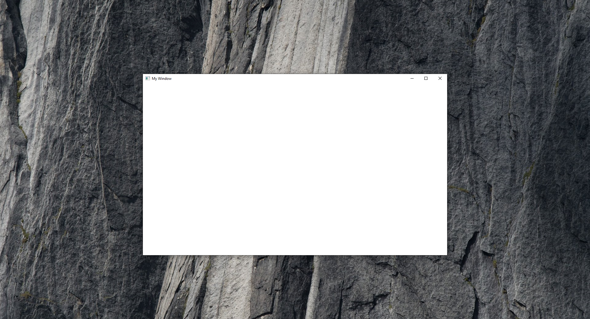

# Project: Win32 Window
This is a simple project, which consists of using the Win32 API to create a window and then displaying this window at the centre of the screen. I have used the Win32 API to create a window in previous projects using the Visual Studio Windows Desktop Application template. I wanted to create this project using CMake. While I have used CMake with console applications before, I have not used it with GUI applications. 

## CMake
### CMakeLists.txt
This is a simple CMake project so I only have a single `cmake•CMakeLists.txt` file which is in the below code fence. The file consists of the usual CMake setup except I specify the `cmake•WIN32` property when calling the `cmake•add_executable` command. This makes `cmake•Window`a GUI executable instead of a console application. And the entry point to the program will now be `C++•WinMain` or `C++•wWinMain` rather than `C++•main`.

It is possible to create a window within a console application, which can be beneficial during development for error output and debugging. I opted to develop it as a GUI application and manage error output independently.

```cmake {numberLines, filePath:{path:'Win32-Window/CMakeLists.txt', link:'https://github.com/james-door/Win32-Window/blob/master/CMakeLists.txt'}}
cmake_minimum_required (VERSION 3.8)

project ("Window")
set(CMAKE_CXX_STANDARD 17) #Use C++17
add_executable (Window WIN32 "Window.cpp") #Make a Windows GUI application

option(USE_UNICODE "Support Unicode." OFF)
if(USE_UNICODE)
	target_compile_definitions(Window PUBLIC UNICODE) 
	target_compile_definitions(Window PUBLIC _UNICODE) 
endif()
```
Additionally, I create a CMake option `cmake•USE_UNICODE`. This option once built is stored in the `cmake•CMakeCache.txt`. Once built if we want to change the value of the CMake option we cannot just change the default value in the `cmake•CMakeLists.txt`. We either have to manually edit the `cmake•CMakeCache.txt` or delete it.

 Alternatively, we can change the value of the option by specifying it in the CMake command line, a process which is simplified by using presets. 
When `cmake•USE_UNICODE` is `cmake•ON` we set two compiler definitions `cmake•UNICODE` and `cmake•_UNICODE`. These compiler definitions will set both the Windows API and C runtime respectively to map functions to their wide-character versions. When `cmake•USE_UNICODE` is `cmake•OFF` then the functions will be mapped to narrow character versions. I use the `cmake•PUBLIC` specifier when adding the compile definition to the executable, ensuring that it is applied when linking with the Windows API and C runtime.

### Running the CMake
In order to get an executable to run on our OS we first need to choose a generator. A CMake generator is responsible for translating the platform independent `cmake•CMakeLists.txt` configuration files into platform-specific build files. 

For this project I used [Ninja](https://ninja-build.org/) for my generator. To aid with the building, I created a `cmake•CMakeUserPresets.json` where I created two presets. The presets allow me to set `cmake•USE_UNICODE` without having to manually edit the `cmake•CMakeCache.txt` and allow me to set the generator and compilers I am using, without having to use the CMake command line. The difference between the two presets is the value of the Cmake variable `cmake•CMAKE_BUILD_TYPE`. This variable determines whether the compiler is running in debug or release mode.

```json
{
"version": 3,
"configurePresets": [
    {
        "name": "debug",
        "generator": "Ninja",
        "binaryDir": "${sourceDir}/out/build/debug",
        "cacheVariables": {
        "CMAKE_C_COMPILER": "C:/Program Files/LLVM/bin/clang.exe",
        "CMAKE_CXX_COMPILER": "C:/Program Files/LLVM/bin/clang++.exe",
        "CMAKE_BUILD_TYPE": "Debug",
        "USE_UNICODE" :false
        }
},
        {
        "name": "release",
        "generator": "Ninja",
        "binaryDir": "${sourceDir}/out/build/release",
        "cacheVariables": {
        "CMAKE_C_COMPILER": "C:/Program Files/LLVM/bin/clang.exe",
        "CMAKE_CXX_COMPILER": "C:/Program Files/LLVM/bin/clang++.exe",
        "CMAKE_BUILD_TYPE": "Release",
        "USE_UNICODE" :false
        }
    }
]
}
```
To generate the build files, I use the command-line `cmake•--preset <preset-name>`. Then, I navigate to the build directory and use the `cmake•ninja` command.


## The Window

### Project setup
Given that I am only creating a window, I only require the `C++•Windows.h` header file, which is required for accessing a number of Windows APIs. Furthermore, since I am only using the Win32 API, I define `C++•WIN32_LEAN_AND_MEAN`. This definition excludes a number unrequired APIs. To assist with error logging, I also include a C++ standard library, `C++•sstream`. I also include the Windows header `C++•tchar.h` in order to use the `C++•_T` macro. This macro switches string literals to be wide strings and narrow strings based on the value of `C++•__UNICODE`.
```C++ {numberLines, filePath:{path: 'Win32-Window/Window.cpp',link:'https://github.com/james-door/Win32-Window/blob/master/Window.cpp'}}
#define WIN32_LEAN_AND_MEAN
#include <Windows.h>
#include <sstream>
#include <tchar.h>
```
In the [CMake](#CMake) section I don't explictly link any Win32 library files. Most C++ compilers that support Windows, including Clang++, MSVC, and GCC (when used for Windows development), are configured to automatically link against these standard Windows libraries.

### Debugging
The first step I took was handling any potential future run-time errors generated by the Win32 API. The API doesn't use C++ exceptions for run-time errors so we must manually check for them the using function `C++•FormatMessage`. 

To determine if an error has occured I created the preprocessor macro `C++•HANDLE_RETURN` which takes a Boolean indicating whether an error has occured. I use the predefined macros `C++•__FILE__` and `C++•__LINE__` to identify the file and line the macro was called from. Given that it is no longer a console application we can't output debug information to console. Instead I log any errors in the string stream `C++•Win32ErrorLog`. Given that the language of the messages are English by default there is no need to use Unicode for the error messages and I can use the narrow version `C++•FormatMessageA`.
```C++ {numberLines: 7, filePath:{path: 'Win32-Window/Window.cpp',link:'https://github.com/james-door/Win32-Window/blob/master/Window.cpp'}}
#define HANDLE_RETURN(err) LogIfFailed(err, __FILE__, __LINE__)

std::stringstream Win32ErrorLog;

inline void LogIfFailed(bool err, const char* file, int line)
{
    if (err)
    {
        DWORD error = GetLastError();
        LPVOID lpMsgBuf;
        FormatMessageA(
            FORMAT_MESSAGE_ALLOCATE_BUFFER |
            FORMAT_MESSAGE_FROM_SYSTEM |
            FORMAT_MESSAGE_IGNORE_INSERTS,
            NULL,
            error,
            MAKELANGID(LANG_NEUTRAL, SUBLANG_DEFAULT),
            (LPSTR)&lpMsgBuf,
            0, NULL);


        std::string message = "File: " + std::string(file) + "\n\nMessage: " + std::string((char*)lpMsgBuf) + "\n\nLine: " + std::to_string(line);
        LocalFree(lpMsgBuf);

        Win32ErrorLog << message;
    }
}
```
At the end of the application I then call `C++•displayErrorMessage`,which creates an ANSI Windows dialog box with displaying any error messages.
```C++ {numberLines:108, filePath:{path: 'Win32-Window/Window.cpp',link:'https://github.com/james-door/Win32-Window/blob/master/Window.cpp'}}
if (!Win32ErrorLog.str().empty()) {
        displayErrorMessage("Win32 Errors:\n\n" + Win32ErrorLog.str());
    }
```
 In future I could also choose to log the  messages in a file in case the application never reaches `C++•displayErrorMessage`.


### Creating the window
The first step when creating a window using the Win32 API is to create a window class. A window class is represented as an instance of the `C++•WNDCLASSEX` struct. One of the main fields in this struct is `C++•lpfnWndProc` where we specify the window procedure. For the `C++•hCursor` and `C++•hIconSm` I specify default values, such that it will use the default window icon and cursor icon. And I set the class name to be `C++•"window"`. The class is registered using `C++•RegisterClassEx` which will return `C++•0` if it fails. I use the `C++•HANDLE_RETURN` macro to check this.

```C++ {numberLines: 58, filePath:{path: 'Win32-Window/Window.cpp',link:'https://github.com/james-door/Win32-Window/blob/master/Window.cpp'}}
    WNDCLASSEX winClass = {};
    winClass.cbSize = sizeof(WNDCLASSEX);
    winClass.style = CS_HREDRAW | CS_VREDRAW;
    winClass.lpfnWndProc = WndProc;
    winClass.cbClsExtra = 0;
    winClass.cbWndExtra = 0;
    winClass.hInstance = hInstance;
    winClass.hIcon = NULL;
    winClass.hCursor = LoadCursor(hInstance, NULL);
    winClass.hbrBackground = (HBRUSH)(COLOR_WINDOW+1);
    winClass.lpszMenuName = NULL;
    winClass.lpszClassName = _T("window");
    winClass.hIconSm = LoadIcon(hInstance, NULL);

    HANDLE_RETURN(RegisterClassEx(&winClass) == 0);
```
The client area is the part of the window where the application can render content. The window area includes the client area and other parts of the window such as the title bar, border, and menu bar. I have defined the client area to have a width of `C++•990` and a height of `C++•540` pixels. The function `C++•AdjustWindowRect`  takes the client area and based on the desired style of the window, in this case `C++•WS_OVERLAPPEDWINDOW`, and returns the window area. Based on the returned `C++•RECT` I could now calculate the width and height of the window area. 

I wanted the position of the window when it is created to appear in the centre of the screen. Centring the window requires calculating the coordinates of the top left corner based on the centered window. Using the area of the primary display, which I got using `C++•GetSystemMetrics` and the window area I calculated `C++•centreX` and `C++•centreY`. If I had used the client area in this calculation, these coordinates would be slightly incorrect.
``` C++ {numberLines: 76, filePath:{path: 'Win32-Window/Window.cpp',link:'https://github.com/james-door/Win32-Window/blob/master/Window.cpp'}}
    constexpr LONG defaultWindowWidth = 990;
    constexpr LONG defaultWindowHeight = 540;
    RECT windowArea = {};
    windowArea.left = 0;
    windowArea.top = 0;
    windowArea.right = defaultWindowWidth;
    windowArea.bottom = defaultWindowHeight;

    //Find window area from the client 
    HANDLE_RETURN(AdjustWindowRect(&windowArea, WS_OVERLAPPEDWINDOW, TRUE) == 0);
    int windowAreaWidth = static_cast<int>(windowArea.right - windowArea.left);
    int windowAreaHeight = static_cast<int>(windowArea.bottom - windowArea.top);
    //Find centre of screen coordinates
    int displayWidth = GetSystemMetrics(SM_CXSCREEN);
    int displayHeight = GetSystemMetrics(SM_CYSCREEN);
    int centreX = (displayWidth - windowAreaWidth) / 2;
    int centreY = (displayHeight - windowAreaHeight) / 2;
```
The window is created using the function `C++•CreateWindowEx` which takes the class name, and the window name. The window name what is displayed in title bar if the style includes one. It also takes the style of the window, the location of where it starts and the window area. This function does not activate the widow nor does it display the window. To activate the window and display it in its current size I called the function `C++•ShowWindow` with a value of `C++•SW_SHOW`.

```C++ {numberLines: 95, filePath:{path: 'Win32-Window/Window.cpp',link:'https://github.com/james-door/Win32-Window/blob/master/Window.cpp'}}
    HWND windowHandle = CreateWindowEx(NULL, _T("window"), _T("My Window"), WS_OVERLAPPEDWINDOW, centreX, centreY,
        windowAreaWidth, windowAreaHeight, NULL, NULL, hInstance, nullptr);
    HANDLE_RETURN(windowHandle == NULL);

    ShowWindow(windowHandle, SW_SHOW);
```
Even if we have declared the correct prototype for window procedure `C++•lpfnWndProc`, running this code currently would cause a Win32 error. This is because when creating the window a valid window procedure is required.
### Window procedure
The window procedure is a callback that handles window messages for a particular window. When we create a window class we specify a window procedure, `C++•lpfnWndProc`. Before we can successfully create a window instance we must create a valid window procedure. To be a valid window procedure there are a minimal amount of message codes that it must deal with. If we don’t wish to manually implement the required message codes we can call the Win32 function `C++•DefWindowProc`. In the below code fence my window procedure deals with only one window message `C++•WM_DESTROY` and returns the default behaviour for every other window message.

The window message `C++•WM_DESTORY` is sent to the window procedure of the window being destroyed after the window is removed from the screen. I handle the message by sending the thread message `C++•WM_QUIT` using the function `C++•PostQuitMessage`.

```C++ {numberLines:41, filePath:{path: 'Win32-Window/Window.cpp',link:'https://github.com/james-door/Win32-Window/blob/master/Window.cpp'}}
LRESULT WndProc(HWND hWnd, UINT uMsg, WPARAM wParam, LPARAM lParam) {
    switch (uMsg) {
    case WM_DESTROY:
        PostQuitMessage(0);
        break;
    default:
        return DefWindowProc(hWnd, uMsg, wParam, lParam);
    }
    return 0;
}
```
### Message Loop
The message loop continually reads messages from the message queue dispatching window messages to their relevant window procedures and dealing with any thread messages. In the below code fence I continually loop until the thread message `C++•WM_QUIT` is read from the message queue. Messages are read from the message queue using the function `C++•GetMessage`. Since `C++•GetMessage` in this instance is called with `C++•NULL` for the window handle, it retrieves messages for any window in the current thread and also thread messages. The function is also blocking, meaning that it waits for a message to be available before returning. If a window message has been retrieved, `C++•DispatchMessage` dispatches it to the procedure associated with the message's target window

``` C++ {numberLines: 102, filePath:{path: 'Win32-Window/Window.cpp',link:'https://github.com/james-door/Win32-Window/blob/master/Window.cpp'} }
    MSG windowMsg= {};
    while (windowMsg.message != WM_QUIT) {
        GetMessage(&windowMsg, NULL, 0, 0);
        DispatchMessage(&windowMsg);
    }
```

Without completing the message loop, the window will appear, but then the program will finish executing, and the window will instantly close. Now, with the message loop, here is the created window. It's not much, but it is centered (Note: it is not centered in the screenshot, as the taskbar has been cut off).



